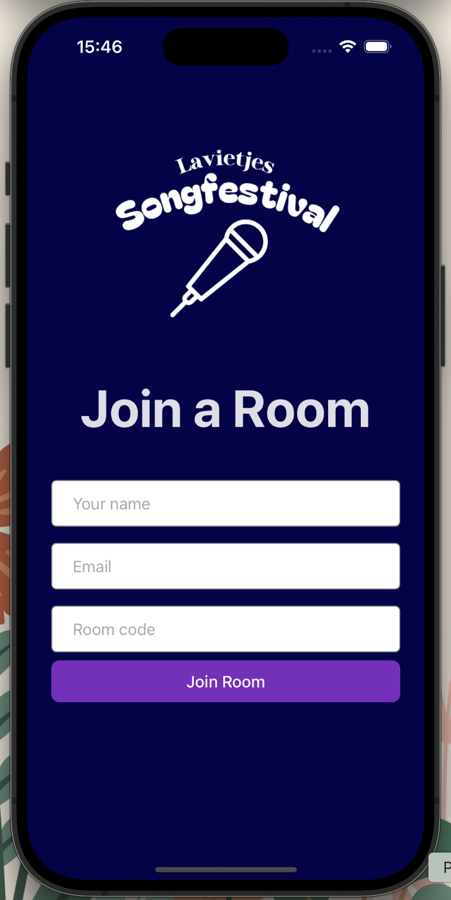
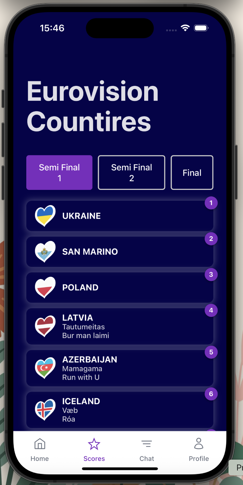
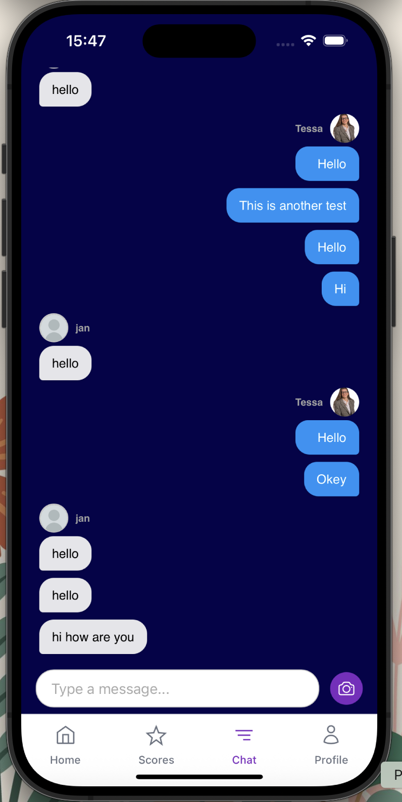
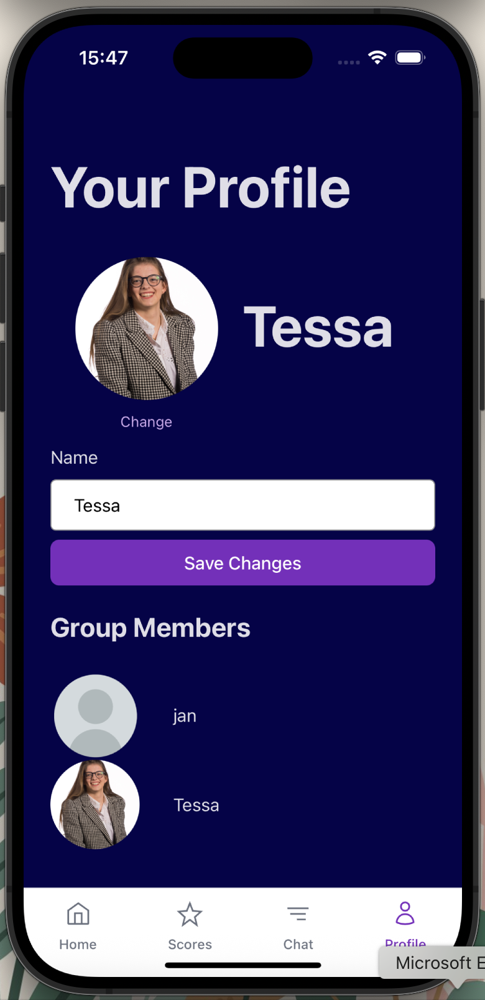

# 🎤 Eurovision Fan Voting PWA

A real-time, fan-made Eurovision pwa app where users can chat, vote, and take notes — all in private groups.

Built with **Vue 3** and **Supabase** (PostgreSQL, Auth, Storage, RLS).

> ⚠️ This is a personal project and not affiliated with the official Eurovision Song Contest or the EBU.

---

## ✨ Features

- 🔐 User authentication
- 👥 Group-based chat and access
- 🗳️ Vote casting and tracking per user/group
- 📝 Private notes
- 🖼️ Avatar and image upload support (via Supabase Storage)
- 🌍 Eurovision-style heart flags (from Wikimedia Commons)

---

## 🛠️ Tech Stack

- [Vue 3](https://vuejs.org/)
- [Vue Router](https://router.vuejs.org/) – for client-side navigation
- [Supabase](https://supabase.com/)
- [PostgreSQL + RLS](https://supabase.com/docs/guides/auth/row-level-security)
- HTML5 & CSS3 – markup and styling
- Typescript
- SVG icons – inline from [W3C SVG](https://www.w3.org/2000/svg)
  
---

## 📸 Screenshot
<p align="center">
  
  
  
  
</p>


---

## 🚀 Getting Started

> This app does **not** connect to a shared Supabase instance. You’ll create your own (free) Supabase project.

### 1. Clone the Repository

```bash
git clone https://github.com/tessalimbeek/eurovision-app.git
cd eurovision-app
```

### 2. Install dependencies

```bash
npm install
```
### 3. Create Supabase Project

1. Go to supabase.com and create a new project.
2. In the dashboard, find your project’s:
   - URL
   - anon/public API key
These will be used in your local environment.

### 4. Create Tables, Policies, and Functions

In the Supabase dashboard:

Open the SQL Editor
Paste and run the contents of supabase/schema.sql
(This file defines all tables, RLS policies, and functions)
    
### 5. Configure Environment Variables

Create a file called .env in the root directory:

```bash
VITE_SUPABASE_URL=https://your-project-id.supabase.co
VITE_SUPABASE_ANON_KEY=your-anon-key
```

🔐 Do not share your .env file. Add it to .gitignore.

You can also copy .env.example and rename it to .env.


### 6. Start the App

```bash
npm run dev
```
Open your browser to http://localhost:5173


## Project structure

```bash
├── eurovision/
│   ├── public/
│   │   └── flags/              # Eurovision heart flags
│   ├── src/
│   │   ├── components/
│   │   ├── composables/ 
│   │   ├── views/
│   │   ├── router/
│   │   ├── types/
│   │   ├── App.vue
│   │   └── main.ts
│   ├── supabase/
│   │   └── schema.sql          # Full SQL setup
│   ├── .env.example
│   └── README.md
```

## Flag Assets License
- [Source: Wikimedia Commons – Flag heart symbols of Eurovision](https://commons.wikimedia.org/wiki/Flag_heart_symbols_of_Eurovision).
- [License: Creative Commons Attribution-ShareAlike 4.0](https://creativecommons.org/licenses/by-sa/4.0/)

## Disclaimer
This project is a fan-made portfolio/demo app.
It is not affiliated with the Eurovision Song Contest or the European Broadcasting Union (EBU).

## Contact
If you like the project or have questions, feel free to fork it or reach out!

Made with ❤️ by Tessa


